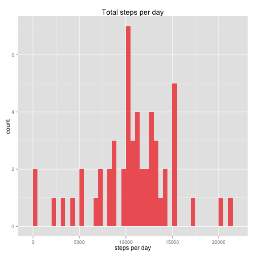
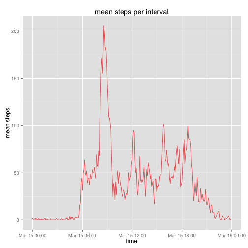
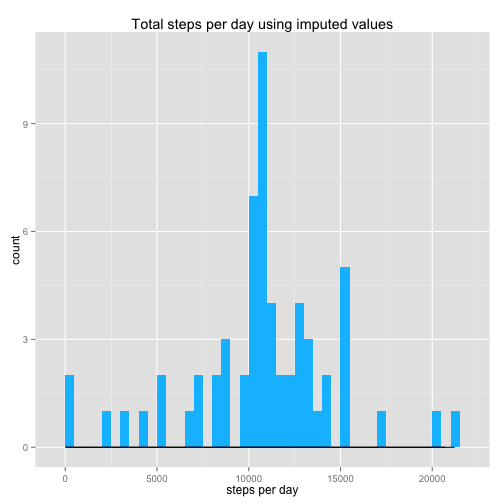
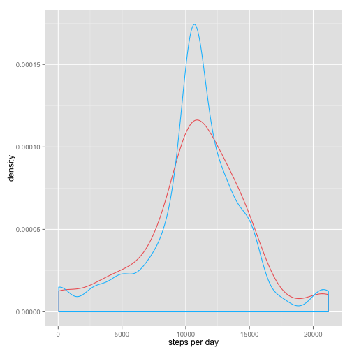
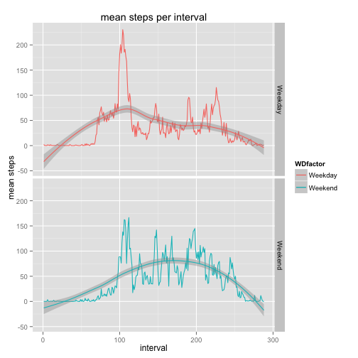

Activity Monitoring Assignment
================================

## Loading and Processing the Data

Loading the data:


```r
Url  <- "https://d396qusza40orc.cloudfront.net/repdata%2Fdata%2Factivity.zip"
temp <- tempfile()
download.file(Url,temp, method="curl")
con <- unz(temp, "activity.csv")
dat <- read.csv(con)
unlink(temp)
```

To tidy the data we will keep the NA values, and only convert the time and date variables, in order to use the tidy data frame to impute the NA values later.


```r
intervals <- sprintf("%04d", as.numeric(dat$interval))
intervals2 <- strptime(intervals, format="%H%M")
actNA <- cbind.data.frame(dat, intervals2)
actNA$date <- as.Date(actNA$date, format = "%Y-%m-%d")
```

Date and interval now have a date and time format. Now NAs can be removed in a new dataset.


```r
library(data.table)
act <- na.omit(actNA)
act$interval <- NULL
actNA$interval <- NULL

act  <- as.data.table(act)
```

## Steps taken per day
We calculate steps taken per day using the data.table package, and plot them using ggplot2


```r
num_steps <- act[, sum(steps), by=date]
setnames(num_steps,"V1","steps_per_day")
total_steps <- num_steps$steps
library(ggplot2)
ggplot(num_steps, aes(x = steps_per_day)) + geom_histogram(binwidth=500, fill="indianred2") + ggtitle("Total steps per day") + labs(x = "steps per day")
```

 

Calculate and report the mean and median total number of steps taken per day

```r
mean_steps  <-  mean(num_steps$steps_per_day)
median_steps  <- median(num_steps$steps_per_day)
message("mean of total steps taken per day: ", mean_steps)
```

```
## mean of total steps taken per day: 10766.1886792453
```

```r
message("median of total steps taken per day: ", median_steps)
```

```
## median of total steps taken per day: 10765
```

##Average Daily Activity Pattern

Again using data.table and ggplot2, we plot the average number of steps taken over all days, against the five-minute intervals


```r
interval_means <- act[,mean(steps), by=intervals2]
setnames(interval_means, "V1", "mean_steps")
setnames(interval_means, "intervals2", "interval")

ggplot(interval_means, aes(x = interval, y = mean_steps))+geom_line(color="indianred2")+ggtitle("mean steps per interval")+labs(x="time", y="mean steps")
```

 

From the time series we can see that there is a clear maximum around 8AM, indeed the 5-minute interval, on average across all the days in the dataset, containing the maximum number of steps is


```r
maxmean <- max(interval_means$mean_steps)
subset(interval_means, mean_steps==maxmean, select=interval)
```

```
##               interval
## 1: 2015-03-15 08:35:00
```

```r
message("interval with greatest average steps per day is 8:35")
```

```
## interval with greatest average steps per day is 8:35
```

## Imputing Missing Values
There are a number of NA values for the step count in our original dataframe.

```r
NA_count <- sum(is.na(actNA$steps))
NA_count
```

```
## [1] 2304
```

Using data.table we impute the missing steps values using the mean number of steps at the time of the missing value, over all days in the dataset. 


```r
actNA$interval <- as.factor(actNA$interval)
actNA <- data.table(actNA)
actNA[,intervals2:=NULL]
```

```
##        steps       date            interval
##     1:    NA 2012-10-01 2015-03-15 00:00:00
##     2:    NA 2012-10-01 2015-03-15 00:05:00
##     3:    NA 2012-10-01 2015-03-15 00:10:00
##     4:    NA 2012-10-01 2015-03-15 00:15:00
##     5:    NA 2012-10-01 2015-03-15 00:20:00
##    ---                                     
## 17564:    NA 2012-11-30 2015-03-15 23:35:00
## 17565:    NA 2012-11-30 2015-03-15 23:40:00
## 17566:    NA 2012-11-30 2015-03-15 23:45:00
## 17567:    NA 2012-11-30 2015-03-15 23:50:00
## 17568:    NA 2012-11-30 2015-03-15 23:55:00
```


```r
impute.mean <- function(x) replace(x, is.na(x), mean(x, na.rm = TRUE))
imp_proj <- actNA[, lapply(.SD, impute.mean), by = interval]

imp_proj_ordered <- imp_proj[order(date, interval)]
```
We can now compare our new data, with imputed values, to our previous "clean" data. Calculating the sum of steps per day for each day:


```r
imp_total <- imp_proj_ordered[,sum(steps), by=date]
setnames(imp_total, "V1", "steps_per_day")
imp_mean <- mean(imp_total$steps_per_day)
imp_median <- median(imp_total$steps_per_day)

## new data:
summary(imp_proj_ordered$steps)
```

```
##    Min. 1st Qu.  Median    Mean 3rd Qu.    Max. 
##    0.00    0.00    0.00   37.38   27.00  806.00
```

```r
## old data
summary(act$steps)
```

```
##    Min. 1st Qu.  Median    Mean 3rd Qu.    Max. 
##    0.00    0.00    0.00   37.38   12.00  806.00
```
Because we used mean over intervals to impute the missing data, the mean has stayed the same. The median has also stayed the same, though we can see that the 3rd quartile has increased considerably


```r
ggplot(imp_total, aes(x = steps_per_day)) + geom_histogram(binwidth=500, fill="deepskyblue") + ggtitle("Total steps per day using imputed values") + labs(x = "steps per day")+geom_density()
```

 

Looking at the density function associated with total steps per interval in each data set, we can see how the distribution has narrowed:


```r
ggplot() + geom_density(aes(x=num_steps$steps_per_day), colour="indianred2") + 
        geom_density(aes(x=imp_total$steps_per_day), colour="deepskyblue")
```

 

## Weekdays and Weekends


```r
imp_proj_ordered$date <- as.Date(imp_proj_ordered$date, format = "%Y-%m-%d")
WD <- weekdays(imp_proj_ordered$date)
dayDF <- cbind.data.frame(imp_proj_ordered, WD)
dayDF <- data.table(dayDF) 
weekday <- dayDF[WD=="Monday"|WD=="Tuesday"|WD=="Wednesday"|WD=="Thursday"|WD=="Friday"]
weekend <- dayDF[WD=="Saturday"|WD=="Sunday"]

weekday$interval <- as.factor(weekday$interval)
weekday2 <- weekday[,mean(steps), by=interval]

weekend$interval <- as.factor(weekend$interval)
weekend2 <- weekend[,mean(steps), by=interval]

WDfactor <- c(rep("Weekday", 288), rep("Weekend", 288))

dayfactorDF <- rbind(weekday2, weekend2)
day_final <- dayfactorDF[,WDfactor:=WDfactor]
setnames(day_final, "V1", "steps")
class(day_final$interval) <- as.integer(day_final$interval)

ggplot(day_final, aes(x = interval, y = steps, color=WDfactor))+geom_line()+ggtitle("mean steps per interval")+labs(x="interval", y="mean steps")+facet_grid(WDfactor~.)+geom_smooth()
```

```
## geom_smooth: method="auto" and size of largest group is <1000, so using loess. Use 'method = x' to change the smoothing method.
## geom_smooth: method="auto" and size of largest group is <1000, so using loess. Use 'method = x' to change the smoothing method.
```

 


